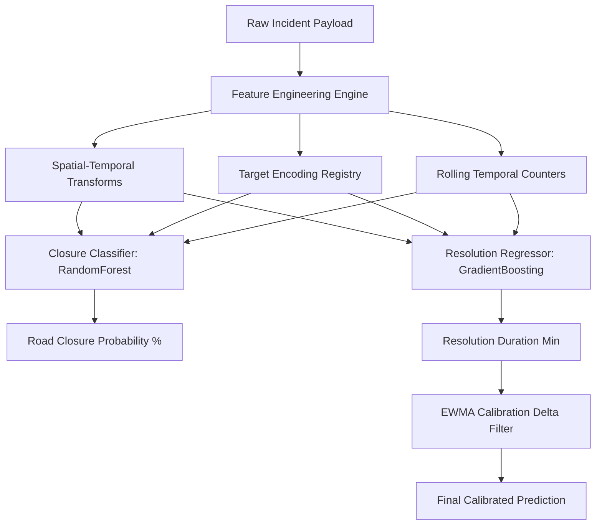

# 🚦 GridLock: Event-Driven Congestion Forecasting & Tactical Recommendation Engine

GridLock is a state-of-the-art, event-driven congestion forecasting and tactical recommendation engine designed for city-wide traffic enforcement in Bangalore. It bridges machine learning predictions, geographical topological graphs, LLM-powered command sandboxes, and automated dispatch APIs into a unified, bilingual command interface.

---

## 🌟 Core Features & Unique Selling Propositions (USPs)

### 1. Cascading Impact Predictor (BFS Wave Propagation)
Instead of looking at traffic incidents in isolation, GridLock models the road network as a directed adjacency graph of major Bangalore corridors. When an incident occurs, the engine runs a **Breadth-First Search (BFS)** traversal to model the physical spillover of traffic.
* **Decay & Attenuation:** Impact decays exponentially per hop:
  * *Standard decay:* $Score_{Depth+1} = Score_{Depth} \times 0.50$
  * *Aggressive decay* (for Vip Movement, Protest, Procession): $Score_{Depth+1} = Score_{Depth} \times 0.60$ (congestion spreads further and decays slower).
* **Peak Hour Amplification:** During morning peak (7:00–10:00) or evening peak (17:00–21:00), the initial propagation score is scaled by `1.15` to model rush-hour congestion density.

### 2. Auto-Calibrating ML Feedback Loop
When dispatchers log actual incident durations in the field, the backend updates a persistent correction registry using an **Exponentially Weighted Moving Average (EWMA)** bias-correction table:
$$\Delta_t = ActualTime - PredictedTime$$
$$EWMA_t = \alpha \times \Delta_t + (1 - \alpha) \times EWMA_{t-1}$$
Every logged feedback instantly corrects subsequent regression predictions without requiring immediate full-model retraining.

### 3. Precision Barricading & Choke Point Optimizer
GridLock uses historical bottleneck data to recommend the exact locations and footprints of barriers and officers to deploy, maximizing diversion efficiency:
$$\text{Efficiency \%} = \text{Base Efficiency} \times (1 - \text{Junction Closure Rate \%}) \times \text{Corridor Multiplier}$$
This prevents the need for guess-work, providing exact choke-point coordinates and recommended resource counts (officers & barricades).

### 4. What-If Scenario LLM Simulator
Commanders can run conversational hypotheticals (e.g., *"What if we deploy 4 more officers?"* or *"What if we do not close the road?"*) against the network, powered by Gemini/Groq APIs to forecast clearance rate adjustments.

### 5. Automated Dispatch & Multi-modal Feedback
* **Twilio WhatsApp Dispatcher:** Generates structured dispatch cards sent directly to ground officers' phones.
* **Voice-Based Feedback Input Parser:** Transcribes and parses spoken radio briefs (via Groq Whisper/LLaMA or regex fallbacks) to log ground truth parameters.
* **TTS Narration:** Verbalizes briefings for eyes-free operation.
* **Bilingual UI:** Native support for English and Kannada (`kn`) translations across all dashboard interfaces.

---

## 🧠 Machine Learning & Algorithmic Design

GridLock runs two distinct serialized model pipelines:
1. **Road Closure Model (`RandomForestClassifier`):** Predicts lane-blocking probabilities.
2. **Resolution Time Model (`GradientBoostingRegressor`):** Forecasts clearance duration in minutes.



### Key Mathematical Formulations

* **Trigonometric Time Projection:** Projects cyclic time units onto a continuous unit circle:
  $$\theta_{hour} = \frac{2\pi \times \text{Hour}}{24}$$
  $$Hour_{sin} = \sin(\theta_{hour}), \quad Hour_{cos} = \cos(\theta_{hour})$$
* **Logarithmic Normalization:** To stabilize training on heavy-tailed delay distributions, the regressor trains on log-transformed targets:
  $$y_{transformed} = \ln(1 + y)$$
  At inference, predictions are reconstructed using:
  $$\hat{y}_{minutes} = e^{\hat{y}} - 1$$
* **Spatial Coordinate Grid Binning:** Continuous coordinates are binned into $2.77\text{ km} \times 2.77\text{ km}$ spatial sectors (0.025-degree resolution):
  $$\text{Lat}_{bin} = \lfloor \frac{\text{Latitude} - 12.8}{0.025} \rfloor, \quad \text{Lon}_{bin} = \lfloor \frac{\text{Longitude} - 77.4}{0.025} \rfloor$$

---

## ⚙️ Project Structure

```
Flipkartgridlock/
├── backend/
│   ├── main.py              # FastAPI application server, endpoints & logic
│   ├── retrain_job.py       # Daily 2:00 AM Cron/Scheduler job for model retraining
│   ├── requirements.txt     # Python dependencies (FastAPI, scikit-learn, pandas)
│   └── .env                 # Environment variables (API keys)
├── frontend/
│   ├── src/                 # React UI Components, Maps, and Views
│   ├── package.json         # React + Vite dependencies & script commands
│   ├── vite.config.js       # Vite build configurations
│   └── README.md            # Frontend template notes
├── features_and_ml_logic.md # Detailed architecture and engineering documentation
└── README.md                # Project main documentation (this file)
```

---

## 🚀 Setup & Execution Guide

### 1. Backend Setup (FastAPI)
1. Navigate to the backend directory:
   ```bash
   cd backend
   ```
2. Create and activate a virtual environment:
   ```bash
   python -m venv .venv
   # Windows
   .venv\Scripts\activate
   # macOS/Linux
   source .venv/bin/activate
   ```
3. Install dependencies:
   ```bash
   pip install -r requirements.txt
   ```
4. Create a `.env` file in the `backend/` directory:
   ```env
   GROQ_API_KEY=your_groq_api_key_here
   GEMINI_API_KEY=your_gemini_api_key_here
   TWILIO_ACCOUNT_SID=your_twilio_sid_here
   TWILIO_AUTH_TOKEN=your_twilio_token_here
   ```
5. Run the FastAPI development server:
   ```bash
   uvicorn main:app --reload --port 8000
   ```

### 2. Frontend Setup (React + Vite)
1. Navigate to the frontend directory:
   ```bash
   cd ../frontend
   ```
2. Install npm packages:
   ```bash
   npm install
   ```
3. Run the frontend development server:
   ```bash
   npm run dev
   ```
4. Open the displayed local address (typically `http://localhost:5173`) in your browser.

### 3. Nightly Retraining
The backend server runs an automatic daily cron task scheduled at **02:00 AM** that:
1. Syncs feedback entries from `feedback_log.csv`.
2. Appends records to the main dataset.
3. Refits Target Encoders & Label Encoders.
4. Retrains and validates the `GradientBoosting` and `RandomForest` estimators.
5. Performs a hot-swap in memory with zero server downtime.
