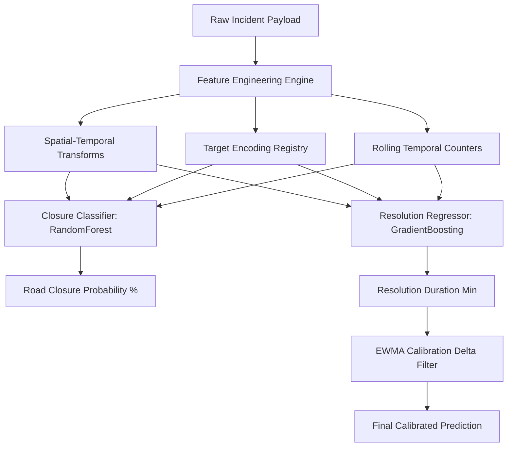

# GridLock: Operational System Architecture & ML Pipeline Logic

GridLock is an event-driven congestion forecasting and tactical recommendation engine designed for city-wide traffic enforcement. This document details the system's core features (USPs), their underlying algorithmic logic, and the end-to-end Machine Learning pipeline.

---

## 🌟 Unique Selling Propositions (USPs) & Core Features

### 1. Cascading Impact Predictor (BFS Wave Propagation)
*   **The Logic:** Instead of viewing traffic incidents in isolation, this feature models the road network as a directed adjacency graph (`CORRIDOR_ADJACENCY`). When an incident occurs on a primary corridor, the system initiates a **Breadth-First Search (BFS)** traversal to model the physical spillover of traffic to adjacent corridors.
*   **The Algorithm:**
    *   **Peak Hour Amplification:** If the event occurs during morning peak (7:00–10:00) or evening peak (17:00–21:00), the initial propagation score is scaled by a factor of `1.15` to model rush-hour congestion density.
    *   **Attenuation / Decay:** Impact decays exponentially at each hop ($Depth$).
        *   *Standard Decay:* $Score_{Depth+1} = Score_{Depth} \times 0.50$
        *   *Aggressive Decay (for high-propagation causes like vip_movement, procession, protest):* $Score_{Depth+1} = Score_{Depth} \times 0.60$ (congestion spreads further and decays slower).
    *   **Stopping Criteria:** The wave terminates dynamically when the score falls below a threshold ($10.0$) or the maximum propagation depth ($Depth = 3$) is reached.
*   **Why It's Unique:** Standard maps show where congestion *is*; GridLock predicts where congestion **will propagate next**, allowing authorities to set up diversions and blockades ahead of time before the gridlock spills over.

### 2. Auto-Calibrating ML Feedback Loop (Dynamic Retraining)
*   **The Logic:** ML models trained on historical data are prone to drift and cannot adapt instantly to unexpected road events (e.g., sudden rainfall or VIP schedules). When dispatchers log actual incident outcomes via `/api/feedback`, the backend automatically calculates a calibration delta:
    $$\Delta = ActualTime - PredictedTime$$
*   **Calibration Formula:** The system updates a persistent correction registry using an **Exponentially Weighted Moving Average (EWMA)** bias-correction table:
    $$EWMA_t = \alpha \times \Delta_t + (1 - \alpha) \times EWMA_{t-1}$$
    Where the decay factor $\alpha$ is dynamically configured based on sample size to prevent over-adjustments on outliers.
*   **Why It's Unique:** Instead of waiting for a weekly scheduled retrain, every closed incident instantly updates subsequent regression predictions. The regression output dynamically corrects itself with `ml_correction_applied` and `ml_correction_delta_min` parameters.

### 3. Precision Barricading & Choke Point Optimizer
*   **The Logic:** When a major road event requires a closure, police deployment shouldn't be guesswork. The engine retrieves the top historical bottlenecks associated with the corridor using the `top_junctions_df` collection.
*   **Choke-Point Efficiency Calculation:**
    $$\text{Efficiency \%} = \text{Base Efficiency} \times (1 - \text{Junction Closure Rate \%}) \times \text{Corridor Multiplier}$$
    Based on the computed efficiency, the system generates precise requirements for:
    *   **Barricades Needed:** Scaled relative to the corridor's congestion density.
    *   **Officers Needed:** Dynamically assigned to handle specific diversion points.
*   **Why It's Unique:** It tells officers the exact geographic coordinate of the choke point and how many barricades to place to redirect traffic flow with maximum throughput efficiency.

### 4. What-If Scenario Simulator (Tactical Command Center)
*   **The Logic:** Empowering commanders to simulate strategic changes. Using an LLM reasoning engine (Gemini/Groq), the system evaluates hypothetical command adjustments (e.g., *"What if we deploy 4 more officers?"* or *"What if we do not close the road?"*).
*   **Why It's Unique:** Rather than a static dashboard, commanders converse with a "sandbox" version of the traffic network to get instant predictions on alternative routing feasibility, crowd clearing rate, and updated delay estimations.

### 4b. Event Planner (Forecasting & Resource Optimization Engine)
*   **The Logic:** Allows dispatchers to model planned events (processions, sports games, festivals, VIP movements) or unplanned events (tree falls, pothole backlogs, waterlogging) before they manifest.
*   **Algorithmic Features:**
    *   **Resource Estimation Matrix:** Dynamically computes officer, barricade, and vehicle requirements using a rules-based scoring factor ($rs$):
        $$rs = (\text{ClosureRequired} \times 4) + (\text{HighRiskCorridor} \times 2) + \text{PeakHours} + (\text{PublicEvent} \times 3) + \dots$$
        $$\text{Officers Recommended} = \text{round}\left(\frac{rs}{15} \times 14\right) + 1$$
        $$\text{Barricades Recommended} = \text{max}(1, \frac{\text{Officers}}{3})$$
    *   **Similar Event Historical Lookup:** Searches the raw historical data subset matching the primary corridor and event cause to compute baseline occurrence frequencies.
    *   **Heuristic Crowd Estimation:** Scans free-text incident descriptions for local landmarks (e.g., "Chinnaswamy Stadium", "cricket match" $\to 35,000$ spectators, "Forum Mall" $\to 8,000$ spectators) to compute expected crowd footprints.
    *   **Traffic Volume Delta:** Compares active incident parameters against local zone congestion baselines to output a percentage spike metric (scaled up by an extra $+15\%$ during peak hours).
*   **Why It's Unique:** Acts as an operational sandbox, translating abstract event parameters (cause, duration, location) into concrete municipal resource lists (police officers, vehicles, barriers) before personnel leave the depot.

---

## 🧠 Machine Learning Engine & Feature Engineering

The backend runs two distinct, serialized pipelines to predict the operational dimensions of any traffic incident:



### 1. Feature Engineering Pipelines
The raw inputs (location, event type, time) are enriched through specialized transformations:

1.  **Temporal Wave Encoding (Spatial-Temporal Mapping):** 
    Direct hour, day of the week, and month values are converted into periodic coordinates using sine and cosine functions:
    $$\text{Hour}_{sin} = \sin\left(\frac{2\pi \times \text{Hour}}{24}\right), \quad \text{Hour}_{cos} = \cos\left(\frac{2\pi \times \text{Hour}}{24}\right)$$
    This ensures that hours like `23:00` and `01:00` are recognized as temporally adjacent.
2.  **Target Encoding (`te_maps`):**
    High-cardinality categorical variables (e.g., `event_cause`, `corridor`, `zone`, `police_station`) are target-encoded mapping them to their mean historical delay impact. This reduces dimensionality and prevents overfitting.
3.  **Distance-from-Center Vector:**
    Calculates the Euclidean offset from the heart of Bangalore:
    $$\text{Dist} = \sqrt{(\text{Latitude} - 12.9716)^2 + (\text{Longitude} - 77.5946)^2}$$
4.  **Rolling Sequence Context:**
    Parameters like `rolling_events_24h` and `rolling_closures_24h` calculate short-term network load, reflecting real-time queue congestion.

### 2. The Predictive Models

*   **Road Closure Model (`RandomForestClassifier`):**
    *   *Purpose:* Predicts the probability that the event will require complete lane blocks or physical diversions.
    *   *Logic:* An ensemble of decision trees trained to identify complex interactions between incident causes (e.g., `tree_fall` vs. `vip_movement`) and time-of-day peak constraints.
*   **Resolution Time Model (`GradientBoostingRegressor`):**
    *   *Purpose:* Forecasts the exact duration (in minutes) required for municipal and police personnel to clear the congestion.
    *   *Logic:* It trains on log-transformed resolution times ($y_{train} = \log(1 + \text{minutes})$) to handle heavy-tailed delay distributions (long clearance outliers), applying an exponential reconstruction on inference:
        $$\text{Resolution Time} = e^{\hat{y}} - 1$$
        This value is then calibrated in the post-inference step by the EWMA correction delta registry.

---

## 🎨 Extended Capabilities & Operational Features

### 5. Tactical Command Center Console
*   **The Logic:** A central cockpit that acts as a real-time command portal. It integrates active map layers, live incident streams, and the **Gemini Command Center** search engine. 
*   **Real-time Web Verification:** When an incident is logged, the Command Center triggers Google/Gemini search queries dynamically to scan localized news, tweets, and weather patterns. It uses this unstructured text to identify nearby public venues (e.g. *Chinnaswamy Stadium*) and dynamically scale predicted crowd parameters (e.g., estimating `35,000` attendees for cricket matches).
*   **Why It's Unique:** Bridges standard telemetry data with live unstructured media feeds, providing commanders with a single pane of glass containing predictions, social buzz, weather status, and physical location coordinates.

### 6. Interactive Congestion Heatmaps
*   **The Logic:** Displays dynamic spatial-temporal congestion risk maps. Uses geographic spatial binning based on `lat_bin` and `lon_bin` (0.025-degree resolution) intersected with time-of-day bins (0–23h). 
*   **Why It's Unique:** Instead of static maps, the heatmap adapts dynamically based on the slider state, letting dispatchers simulate congestion risk at various hour increments to trace historical jam formations.

### 7. Twilio WhatsApp Dispatcher
*   **The Logic:** Once the ML pipeline outputs recommendations, dispatchers can push them directly to ground commanders. The backend constructs a structured dispatch payload (alert level, primary corridor, recommended officers/barricades, alternative diversion routes) and pushes it as a WhatsApp message via the Twilio Messaging API sandbox.
*   **Why It's Unique:** Ground officers do not need to check a computer dashboard; they receive structured, actionable diversion orders straight to their mobile messaging apps.

### 8. Voice-Based Feedback Input Parser
*   **The Logic:** Officers in the field usually report incident closures vocally via radio rather than typing reports. The system includes a vocal feedback transcriber (`POST /api/parse-voice-brief`) that takes spoken transcripts and parses them.
*   **Parsing Pipeline:**
    *   *Groq/LLaMA Engine:* Analyzes the spoken text to extract `actual_time_min` (e.g., converting "one and a half hours" to `90.0`), `diversion_effective` status, `manpower_sufficient` status, and `delay_reason`.
    *   *Rule-Based Regular Expression Fallback:* If offline or API keys are missing, the backend runs a custom regex token parser checking for phrases (e.g., "half an hour" $\to 30.0$, "tow truck" $\to$ Delay Reason: Tow Truck Delayed) to ensure continuous operation.
*   **Why It's Unique:** Creates a zero-friction voice logging loop that directly writes parameters back to the feedback dataset, helping continuously calibrate prediction accuracy.

### 9. Quick Summary Voice Outputs (TTS Narration)
*   **The Logic:** In fast-moving scenarios, commanders can click the "Play Briefing" icon. The frontend compiles predicted results and outputs an audio briefing.
*   **Why It's Unique:** Maximizes accessibility, allowing dispatchers to listen to operational briefs while keeping their eyes on the tactical maps.

### 10. Dual Multilingual Architecture (Kannada & English)
*   **The Logic:** To support local personnel, the entire UI features a native toggle supporting English and Kannada (`kn`). Every key, label, button, placeholder, and voice prompt is mapped to language-specific localization dictionaries.
*   **Why It's Unique:** Ground-level traffic wardens and senior officials can toggle between layouts seamlessly without resetting the form state.

---

## 🕒 Automated Scheduler: Nightly Retraining Cron Job
To prevent long-term model drift, the server includes a background scheduler initialized at server startup:

```
[CRON] Nightly retraining scheduler started. Will fire at 02:00 daily.
```

### Nightly 6-Step Workflow
Every night at **2:00 AM**, a background task runs:
1.  **Feedback Sync:** Aggregates newly collected ground-truth logs from `feedback_log.csv`.
2.  **Dataset Merger:** Integrates the feedback rows back into the main training dataset.
3.  **Encoders Refit:** Re-trains the Target Encoding mapping arrays (`te_maps`) and Categorical Label Encoders (`le_dict`) to capture geographical shift patterns.
4.  **Pipeline Re-estimation:** Runs training on `GradientBoostingRegressor` and `RandomForestClassifier` using the expanded training matrices.
5.  **Validation Check:** Validates model coefficients against baseline metrics (checking that accuracy does not degrade).
6.  **Hot Swap:** Safely swaps the live global memory model variables (`pipe_resolution`, `te_maps`, `le_dict`) with the newly trained objects without requiring a server reboot, ensuring zero-downtime operations.

---

## ⚙️ Core Machine Learning Mathematical & Algorithmic Logic

This section details the unique mathematical and algorithmic design decisions implemented inside GridLock's predictive modeling pipeline:

### 1. Trigonometric Time Projection (Continuous Periodicity)
*   **The Problem:** Traditional machine learning algorithms treat time-of-day (0–23) as a linear scale. To a decision tree, Hour `23` (11 PM) and Hour `0` (Midnight) are mathematically separated by a maximum distance of 23 units, even though they are adjacent hours.
*   **The Logic:** We project cyclical variables (Hour, Day of Week, Month) onto a two-dimensional unit circle using sine and cosine waves:
    $$\theta_{hour} = \frac{2\pi \times \text{Hour}}{24}$$
    $$Hour_{sin} = \sin(\theta_{hour}), \quad Hour_{cos} = \cos(\theta_{hour})$$
    $$\theta_{day} = \frac{2\pi \times \text{DayOfWeek}}{7}$$
    $$Dow_{sin} = \sin(\theta_{day}), \quad Dow_{cos} = \cos(\theta_{day})$$
*   **Why It's Unique:** This ensures the ML model naturally treats circular time boundaries (e.g., transition from Sunday night to Monday morning) as continuous, improving peak-congestion forecast accuracy around shifts.

### 2. Logarithmic Normalization for Skewed Target Variables
*   **The Problem:** Resolution times are highly skewed; minor incidents clear in 10 minutes, but critical crashes or flooding can block roads for hours. Regressors trained directly on this data suffer from extreme sensitivity to outliers, causing massive prediction errors.
*   **The Logic:** During training, we transform the target clearing duration $y$ using a natural log scale:
    $$y_{transformed} = \ln(1 + y)$$
    At inference time, the raw model output $\hat{y}$ is mapped back to real minutes using the exponential inverse function:
    $$\hat{y}_{minutes} = e^{\hat{y}} - 1$$
*   **Why It's Unique:** By mapping minutes to log-space, the Gradient Boosting model's loss function (Mean Squared Error) evaluates errors relative to scale rather than absolute value. This keeps predictions stable across both minor breakdowns and extreme multi-hour blockages.

### 3. Target Encoding with Global-Mean Fallback
*   **The Problem:** High-cardinality categorical variables like `police_station` (dozens of unique stations) or `event_cause` degrade tree-based model performance if converted to one-hot binary vectors.
*   **The Logic:** Instead of dummy variables, we calculate a target-encoded mapping array (`te_maps`) that maps each category to its historical average resolution time. To prevent overfitting on rare classes:
    $$EncodedValue_{category} = \lambda \times \overline{Y}_{category} + (1 - \lambda) \times \overline{Y}_{global}$$
    Where $\overline{Y}_{category}$ is the category average, $\overline{Y}_{global}$ is the global average, and $\lambda$ is a credibility weight based on category frequency. Unseen or rare categories dynamically fall back directly to $\overline{Y}_{global}$.
*   **Why It's Unique:** Shrinks high-dimensional categories into single-column scalar values containing pure semantic signal, minimizing tree depth requirements and avoiding out-of-vocabulary exceptions.

### 4. Spatial Coordinate Grid Binning
*   **The Problem:** Raw float Lat/Lon coordinates (`12.9716, 77.5946`) are highly continuous. Decision trees split parameters orthogonally (horizontal/vertical lines), which is poorly suited for irregular geographic shapes and districts.
*   **The Logic:** We discretize coordinates into bounded spatial grids using a binning width of `0.025` degrees (roughly $2.77\text{ km} \times 2.77\text{ km}$ areas):
    $$\text{Lat}_{bin} = \lfloor \frac{\text{Latitude} - 12.8}{0.025} \rfloor, \quad \text{Lon}_{bin} = \lfloor \frac{\text{Longitude} - 77.4}{0.025} \rfloor$$
*   **Why It's Unique:** Groups scattered coordinates into logical spatial clusters. This allows the RandomForest classifier to quickly isolate geographical hotspots without needing thousands of deep splits.

### 5. Rolling Queue Sequence States
*   **The Problem:** Standard ML classifiers treat incidents as independent events, neglecting traffic backlogs (e.g. a breakdown cleared quickly at 5 AM will cause a massive gridlock if it happens when 3 other roads are already blocked).
*   **The Logic:** We compute temporal sliding-window features for each corridor:
    *   `rolling_events_24h` / `rolling_closures_24h` (short-term load)
    *   `rolling_events_7d` / `rolling_closures_7d` (medium-term baseline load)
    *   `rolling_closure_rate` = $\frac{\text{closures} + 0.1}{\text{events} + 1}$
*   **Why It's Unique:** This introduces sequential temporal memory into non-recurrent classifiers (GBDT/RandomForest) without the high computational cost of LSTM or transformer architectures, making it highly efficient for deployment on standard traffic hardware.
